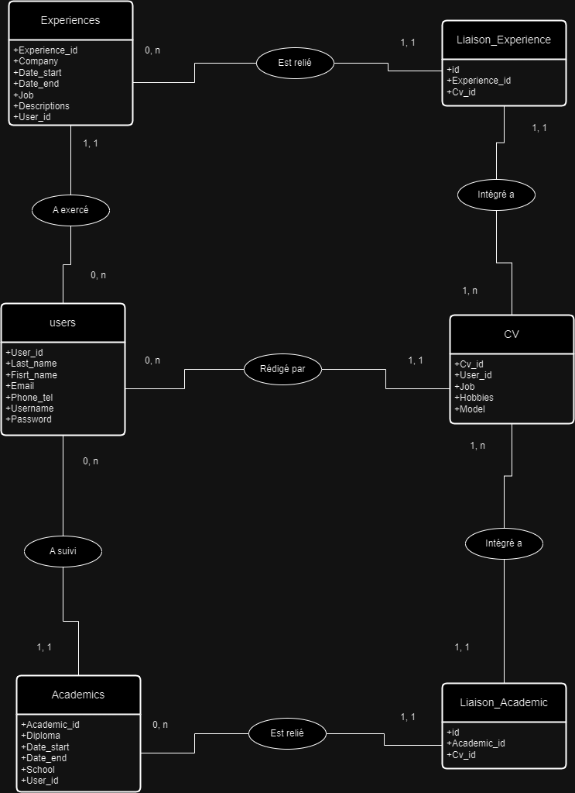
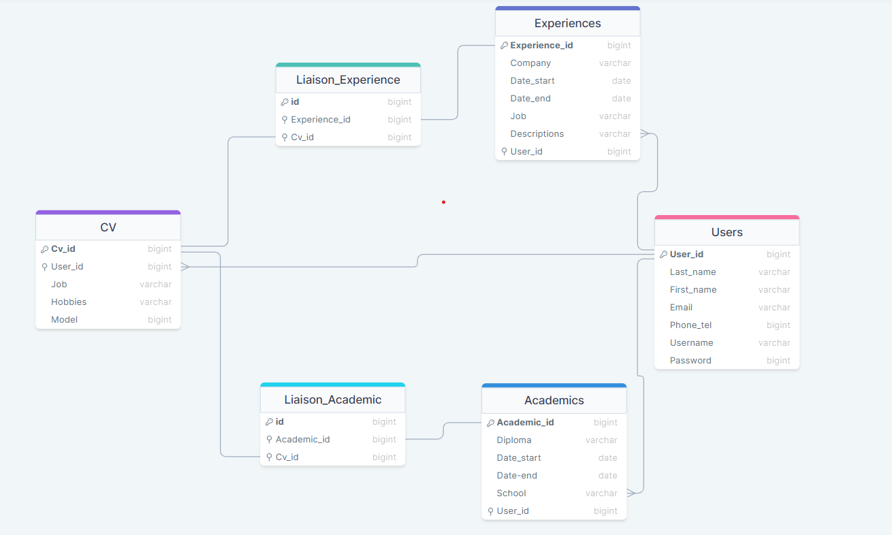
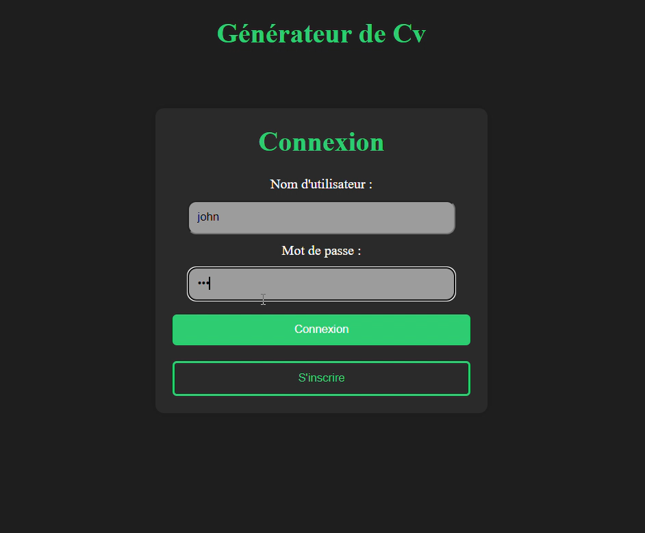

# Générateur de CV

    Créer des cv en ligne, depuis le navigateur
    Afficher et modifier un cv déjà créé et stocker en base de donnée
    Générer des CV au format PDF

## Consignes

    - Permettre la création d’un compte
    - Utiliser des formulaires pour récolter les informations
    - Définir des classes afin de permettre un choix dans une bibliothèque de modèles.
    - Mettre en place des procédures de contrôle et validation des données
    - Monter une base de données ou les données seront stockés
    - Utiliser des librairies natives au PHP pour générer les PDF.

## Installation

#### Avec phpMyAdmin

Cloner le repository dans votre dossier racine, dans xampp, dans le dossier htdocs : 
    
    C:\xampp\htdocs

#### Avec Laragon
Cloner le repository dans votre dossier racine, dans laragon, dans le dossier www :

    C:\laragon\www    

Cloner repository :
 ```bash
 git clone https://github.com/lucille452/generateur_de_CV.git
 ```

## Lancer

```bash
php -S localhost:8080
 ```
Accédez à l'application dans le navigateur à l'adresse : http://localhost/Generateur_de_CV/Front/Templates.

## MCD



## MLD



## Démonstration
[](Demo/demo_generation_cv.mp4)
